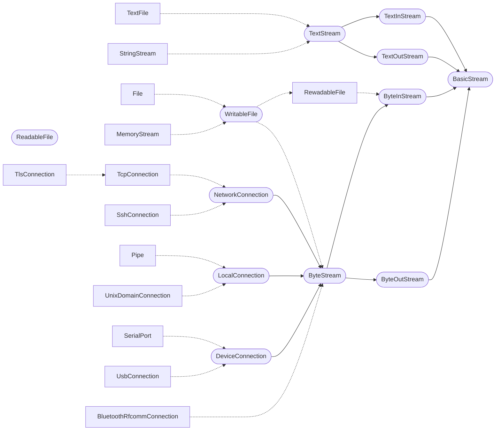

# Stream, File & Command Line Interface

## Global IO Functions

- `print("...")` with Newline,
    - calls `cout.writeLine()`.
- `readLine() -> String` reads up to Newline,
    - calls `cin.readLine()`.
- `input("Name? ") -> String`
    - as in Python,
    - calls `cout.write()`, then `cin.readLine()`.
    - `input(String prompt = "") -> String`

## BasicStream

Interface as base for `Text*Stream` and `Byte*Stream`.

- `stream.isOpen() -> Bool`
- `stream.close()`

## TextStream

Interface for input / output of _text_.

### TextOutStream

Interface for writing text.

- `cout.write("...")` without newline.
- `cout.writeLine("...")` with newline.
- `cout.write(Char32 codePoint)`  

`cout << "Text"` is possible, but stateless only (i.e. no manipulators besides `endl` and `flush`).

### TextInStream

Interface for reading text.

- `cin.read() -> String` reads
    - everything from the `istream` user-level cache (if not empty),
    - or (otherwise) everything from the kernel buffer/cache:
        - With pipes/sockets this is everything currently in the kernel pipe/socket buffer (typically up to 64 KB). Blocks when this buffer is empty.
            Only when the pipe/socket is closed (and no data is buffered anymore), then it returns `""`.
        - With files this is everything currently in the kernel "read ahead" cache (typically 64 to 256 KB). Blocks when this cache is empty.
            Only when the end of file is reached (and no data is buffered anymore), then it returns `""`.
- `cin.readAll() -> String` reads everything until the end of the file.
    - With pipes/sockets, it blocks until the pipe/socket is closed.
- `cin.readLine() -> String` reads until newline (or end of file).
    - The newline character is removed from the line.
        - `\n`, `\r`, `\r\n` are recognized as (a single) newline.
        - (Maybe even `\n\r` from AmigaOS, and `NEL`/`U+0085` from EBCDIC/IBM.)
    - With pipes/sockets it blocks until a line is available (or pipe/socket is closed).
    - When the end of file is reached, then it returns `""`.
    - But as empty lines are also read as `""`, you need to check `atEnd()` here.
- `cin.readGraphemeCluster() -> String` reads a single grapheme cluster (mostly a character).
    - Returns a `String`, as UTF-8 "characters"/grapheme clusters may consist of multiple code points (therefore called a "grapheme _cluster_").
    - With pipes/sockets it blocks until a character is available (or the pipe/socket is closed).
    - When the end of file is reached, then it returns `""`.
    - Unicode variant of ~~`cin.readChar() -> Char`~~.
- `cin.readCodePoint() -> Char32` reads a single Unicode code point (as `Char32`).
    - But beware: some grapheme clusters, like emoji, consist of _multiple_ code points.
    - When the end of file is reached, then it returns `-1`.
- `cin.tryToRead() -> String` reads everything that is immediately available,
    - possibly/often returns `""`, it never blocks.
    - Reads everything from the `istream` user-level cache (if not empty),
    - or (otherwise) everything from the kernel buffer/cache:
        - With pipes/sockets this is everything currently in the kernel pipe/socket buffer (typically up to 64 KB).
            Returns `""` when no data is buffered anymore (then maybe the pipe/socket is closed).
        - With files this is everything currently in the kernel "read ahead" cache (typically 64 to 256 KB).
            Returns `""` when no data is buffered anymore (then maybe the end of file is reached).
    - Meant for polling / busy loops only, so _rarely_ appropriate.
    - You need to check `atEnd()` separately!
        - As you cannot distinguish "no data available" from EOF or pipe/socket closed.
- `cin.atEnd()` (instead of ~~`cin.isEof()`~~)
    - returns `True` if
        - the end of the file is reached (or the pipe/socket is closed),
        - and no data is buffered anymore (neither in the `istream` user-level cache, nor in the kernel cache/buffer),
    - Typically necessary to call this function when `cin.read()` or `cin.readLine()` return `""`.  

`cin >> line` is possible, but stateless only.

## TextFile

- `TextFile::open("Test.txt") -> File`
- `TextFile::create("Test.txt") -> File`
- `TextFile::openOrCreate("Test.txt") -> File`

## ByteStream

Interface for input / output of _binary_ data.

- `stream.isOpen() -> Bool`
- `stream.close()`

### ByteOutStream

Interface for writing binary data.

- `out.write(Byte[])`
- `out.flush()` writes the data buffer (the `ostream` user-level cache) to the operating system.
    - This protects against data loss in the event of a program crash.
- `out.flushAndSync()` calls `flush()`, then
    - calls `fsync()` to write the kernel buffers to the file system and then to the hard disk/SSD (the write cache should be written/cleared, too).
    - This protects against data loss in the event of a program or _system_ crash.

### ByteInStream

Interface for reading binary data.

- `in.read() -> Byte[]` reads
    - everything from the `istream` user-level cache, if not `0`,  
        otherwise everything from the kernel buffer/cache:
        - With pipes/sockets this is everything currently in the kernel pipe/socket buffer (typically 64 KB).
            - Blocks when this buffer is empty.
            - When the pipe/socket is closed (and no data is buffered anymore), then it returns an empty array.
        - With files this is everything currently in the kernel "read ahead" cache (typically 64 to 256 KB).
            - Blocks when this cache is empty.
            - When the end of file is reached (and no data is cached anymore), then it returns an empty array.
- `in.read(Int n) -> Byte[]` reads exactly n bytes.
    - Blocks until the given number of bytes are read.
    - Throws an exception if end of file is reached (or pipe/socket closed) before n bytes are read.
- `in.read(Int minimum, maximum) -> Byte[]` reads everything that is currently available, up to the given `maximum` number of bytes.
    - Blocks until (at least) the `minimum` number of bytes are read (may return immediately with an empty array when `minimum` is `0`).
    - `in.read(minimum..maximum) -> Byte[]`
- `in.readAll() -> Byte[]` reads everything until the end of the stream.
    - With pipes/sockets, it blocks until the pipe/socket is closed.
- `in.readInto(Span<Byte> buffer, Int minimum = 1) -> Int` reads into the given buffer.
    - Blocks until (at least) the `minimum` number of bytes are read (may return immediately with an empty array when `minimum` is `0`).
    - Throws an exception if end of file reached (or pipe/socket closed) before `minimum` bytes are read.
    - The effective `maximum` if defined by `buffer.size()`.
        - You may limit the maximum number of bytes to read by using `buffer.subspan(0, 4096)`,
          or configure the starting point (in the buffer) by using `buffer.subspan(100)`.
    - Usually more efficient, as the buffer is reused and less allocations are necessary.
- `in.available() -> Int` says how many bytes are _immediately_ available for reading.
    - Returns the size of the `istream` cache, if not 0,  
      otherwise reports the size of the kernel cache/buffer.
    - As that is the number of bytes you would get with the next `in.read()`.
- `in.peek(Int n) -> Byte[]`
    - Blocks until (at least) the given minimum (`n`) number of bytes are read.
    - May throw an `ArgumentException("Unable to peek() more than ... bytes.")`.
    - TODO Limited to 16 bytes or to the buffer size?
- `in.ignore(Int n)` ignores/discards n bytes from the input stream.
- `in.ignoreAll()` ignores/discards everything that is currently in the input stream.
- `in.atEnd()` returns `True` if
    - the end of the file is reached (or the pipe/socket is closed),
    - and no data is buffered anymore (neither in the `istream` user-level cache, nor in the kernel cache/buffer).

## File IO

Interface `ReadableFile`, derived from `ByteInStream`, to access size and current position (e.g. for seeking):
- `file.size() -> Int`
- `file.position() -> Int`
    - `file.setPosition(Int n)` (AKA ~~`file.seekFromStart()`~~)
    - A common position for read and write.
- `file.seek(Int offsetToCurrentPos)`
    - `offsetToCurrentPos` can be positive (moving towards the end) or negative (moving towards the beginning).
- `file.seekFromEnd(Int distanceToEnd)`
    - `distanceToEnd` is `0` or positive (here moving from the end towards the beginning).

Interface `WritableFile`, derived from `ByteStream`, to modify the size:
- `file.truncate()` truncates the file at the current position.
    - `file.truncateAt(Int n)` truncates the file at the given position.

**`File`**, derived from `WritableFile`:
- `File::open("Test.txt", openMode = OpenMode::Read) -> File`
- `File::create("Test.txt", openMode = OpenMode::Write) -> File`
- `File::openOrCreate("Test.doc", openMode = OpenMode::Write) -> File`
    - `OpenMode`
        - `Read`
        - `Write`
        - `Append`

- `file.path() -> String`

**`MemoryStream`**, derived from `WritableFile`:
- `MemoryStream memoryStream(Int capacity = 0)`

## Network & Device IO

### NetworkConnection

Interface `NetworkConnection`, derived from `ByteStream`, a base class for TCP/IP, Bluetooth RFCOMM, infrared, ...
- `connection.remoteAddress() -> String`
- `connection.localAddress() -> String` for finding out which interface (WLAN, LAN, VPN) the connection is actually running on.
- `connection.readTimeout() -> Duration`
    - `connection.setReadTimeout(Duration)`

### TcpConnection

`TcpConnection`, derived from `NetworkConnection`
- `TcpConnection::open("example.com", 80) -> TcpConnection`
- `connection.shutdownWrite()` sends FIN (half-close), allows further reading.
- `connection.connectionTimeout() -> Duration`
    - `connection.setConnectionTimeout(Duration)`
- `connection.remotePort() -> UInt16`
- `connection.localPort() -> UInt16`
- `connection.noDelay() -> Bool`
    - `connection.setNoDelay(Bool disableNagle)` to disable the Nagle algorithm.
- `connection.keepAlive() -> Bool`
    - `connection.setKeepAlive(Bool)` prevents connection termination due to inactivity.
- `connection.protocolVersion() -> Int` returns `4` or `6`.
- `connection.receiveBufferSize() -> Int`
    - `connection.setReceiveBufferSize(Int bytes)`
- `connection.sendBufferSize() -> Int`
    - `connection.setSendBufferSize(Int bytes)`

### LocalConnection

Interface `LocalConnection`, derived from `ByteStream`, for `Pipe` and `UnixDomainConnection` in stream configuration:
- `connection.path() -> String` returns the file system path (for Unix sockets) or the name (for pipes).
- `connection.peerCredentials() -> String` returns the process ID (PID) or user ID of the other party.
    - TODO Move to `UnixDomainSocket`? But on Windows this info is available for pipes, too.

### SerialPort

`SerialPort` for RS-232/UART:
- `SerialPort::open("COM3", 115200) -> SerialPort`
- `SerialPort::list() -> String[]`
- `serial.setBaudRate(Int)`
- `serial.setParity(Parity)`
- `serial.setDataBits(Int)`

## MessageChannel

`MessageChannel` for message/packet/frame/datagram-based protocols (i.e. _not_ only a stream of bytes), is implemented by:
- `UdpSocket` for UDP over IP.
- `UnixDomainSocket` in datagram configuration.
- Communication with sensors on microcontrollers
    - `I2CDevice` (register read/write cycles)
    - `SpiDevice` (chip-select-controlled frames)
    - `CanBusNode`
- `BluetoothL2CapConnection` Bluetooth L2CAP
- `ZigbeeEndpoint`
- `WebSocketConnection` (message frames over TCP)

## Class Hierarchy

`ByteStream` is implemented by:
- `File`
- `MemoryStream` as RAM buffer.
- `NetworkConnection`
    - `TcpConnection`
        - `TlsConnection` for encrypted TLS and SSL connections
    - `SshConnection`
- `LocalConnection` for interprocess communication.
    - `Pipe`
    - `UnixDomainConnection` in stream configuration.
- `BluetoothRfcommConnection` Bluetooth RFCOMM
- `DeviceConnection`
    - `SerialPort` for RS-232/UART.
    - `UsbConnection` for USB bulk transfers.

