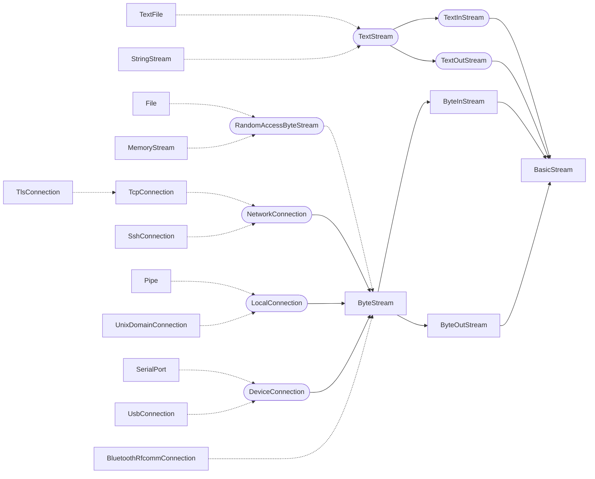

# File, ByteStream & Network

### ByteOutStream

Base class for writing _binary_ data.

- `out.write(Byte[])`
    - also accepts a `Span<Byte>`/`ArrayView<Byte>` (see [parameter passing mode `in`](https://cilialang.org/advanced/parameter-passing/#special-trick-for-types-with-views)) 

- `out.write(Byte)` writes a single byte
- `out.write(Bool)` writes a byte, `0` for `false`, `1` for `true` 

- `out.write(Int8`/`16`/`32`/`64)`
- `out.write(UInt8`/`16`/`32`/`64)`
- `out.write(Float32`/`64)` 

- `preferredWriteSize() -> Int`
    - Returns the preferred number of bytes to provide in a single write operation.
    - The returned value is a performance hint intended for bulk data transfer. It may reflect the buffering characteristics of the underlying operating system or device, but does not limit the maximum amount of data that can be written.
    - The value may vary between stream types and platforms.
    - Typically in the range of 16 to 256 KB.
- `out.flush()` writes the data buffer (the `ostream` user-level cache) to the operating system.
    - This protects against data loss in the event of a program crash.
- `out.flushAndSync()` calls `flush()`, then
    - calls `fsync()` to write the kernel buffers to the file system and then to the hard disk/SSD (the write cache should be written/cleared, too).
    - This protects against data loss in the event of a program or _system_ crash.

Cache:
- `Byte* outBuffer`  
  The output buffer is stored as pointer, to allow a single common buffer as well as two separate buffers for input and output.
- `Int outPosition`
- `Int outCapacity`  
  &nbsp;
- `protected virtual writeRaw(Span<Byte> src)`

### ByteInStream

Base class for reading _binary_ data.

- `in.read() -> Byte[]` reads
    - everything from the input buffer, if not empty,  
      otherwise everything from the kernel buffer/cache:
        - With pipes/sockets this is everything currently in the kernel pipe/socket buffer (typically 64 KB).
        - With files this is everything currently in the kernel "read ahead" cache (typically 64 to 256 KB).
    - Blocks when this buffer/cache is empty.
    - When the pipe/socket is closed / the end of file is reached, and no data is cached anymore, then it returns an empty array.
- `in.read(minimum..) -> Byte[]` reads everything that is currently available.
    - Blocks until (at least) the `minimum` number of bytes are read (may return immediately with an empty array when `minimum` is `0`).
- `in.read(minimum..maximum) -> Byte[]` reads everything that is currently available, up to the given `maximum` number of bytes.
    - Blocks until (at least) the `minimum` number of bytes are read (may return immediately with an empty array when `minimum` is `0`).
- `in.read(Int n) -> Byte[]` reads exactly n bytes.
    - Blocks until the given number of bytes are read.
    - Throws an exception if end of file is reached (or pipe/socket closed) before n bytes are read.
- `in.readAll() -> Byte[]` reads everything until the end of the stream.
    - With pipes/sockets, it blocks until the pipe/socket is closed.
- `in.readInto(Span<Byte> buffer, Int minimum = 1) -> Int` reads into the given buffer.
    - Blocks until (at least) the `minimum` number of bytes are read (may return immediately with an empty array when `minimum` is `0`).
    - Throws an exception if end of file reached (or pipe/socket closed) before `minimum` bytes are read.
    - The effective `maximum` if defined by `buffer.size()`.
        - You may limit the maximum number of bytes to read by using `buffer.subspan(0, 4096)`,
          or configure the starting point (in the buffer) by using `buffer.subspan(100)`.
    - Usually more efficient, as the buffer is reused and less allocations are necessary.
- `in.peek(Int n) -> Byte[]`
    - Blocks until at least `n` bytes are available and returns the next `n` bytes without consuming them.
    - May throw an `ArgumentException("Unable to peek() more than ... bytes.")` if `n` exceeds the maximum number of bytes that can be peeked.
    - `n` is limited by the stream's peek buffer capacity.
- `in.discard(Int n)` ignores/discards the next `n` bytes from the input stream.
    - Blocks until all `n` bytes have been discarded or the end of the stream is reached.
- `in.discardAvailable()` ignores/discards all bytes currently in the input stream.
    - Clears the input buffer _and_ performs a non-blocking read, discarding that bytes, too.
    - Does not block waiting for additional data.
    - Useful for re-synchronizing a stream after invalid or unexpected input.
- `in.atEnd()` returns `True` if
    - the end of the file is reached (or the pipe/socket is closed),
    - and no data is buffered anymore (neither in the `istream` user-level cache, nor in the kernel cache/buffer).
- `preferredReadSize() -> Int`
    - Returns the preferred number of bytes to request in a single read operation.
    - The returned value is a performance hint intended for bulk data transfer. It may reflect the buffering characteristics of the underlying operating system or device, but does not limit the maximum amount of data that can be read.
    - The value may vary between stream types and platforms.
    - Typically in the range of 16 to 256 KB.

Cache:
- `Byte* inBuffer`  
  The input buffer is stored as pointer, to allow a single common buffer as well as two separate buffers for input and output.
- `Int inPosition`
- `Int inCapacity`  
  &nbsp;
- `protected virtual readRaw(Span<Byte> dest, Int minimum = 1)`
- `protected virtual availableRaw() -> Int`
- `protected virtual atEndRaw() -> Bool`

## ByteStream

Base class for input and output of binary data, derived from `BasicStream`, `ByteInStream`, and `ByteOutStream`.

## File IO

### RandomAccessByteStream

Abstract base class derived from `ByteStream`, with additional functions to access/modify the size and current position (e.g. seeking):
- `file.size() -> Int`
- `file.position() -> Int`
    - `file.setPosition(Int n)` (AKA ~~`file.seekFromStart()`~~)
    - A common position for read and write.
- `file.seek(Int offsetToCurrentPos)`
    - `offsetToCurrentPos` can be positive (moving towards the end) or negative (moving towards the beginning).
- `file.seekFromEnd(Int distanceToEnd)`
    - `distanceToEnd` is `0` or positive (here moving from the end towards the beginning).  
      &nbsp;
- `file.truncate()` truncates the file at the current position.
    - `file.truncateAt(Int n)` truncates the file at the given position.  
      &nbsp;
- `protected virtual setPositionRaw(Int position)`
- `protected virtual truncateRaw(Int position)`

### File

Class derived from `RandomAccessByteStream`:
- `File::open("Test.txt", openMode = OpenMode::Read) -> File`
- `File::create("Test.txt", openMode = OpenMode::Write) -> File`
- `File::openOrCreate("Test.doc", openMode = OpenMode::Write) -> File`
    - `OpenMode`
        - `Read`
        - `Write`
        - `Append`  
          &nbsp;
- `file.path() -> String`
- `file.name() -> String`

### MemoryStream

Class derived from `RandomAccessByteStream`:
- `MemoryStream memoryStream(Int capacity = 0)`

## Network & Device IO

### NetworkConnection

Abstract base class derived from `ByteStream`, a base class for TCP/IP, Bluetooth RFCOMM, infrared, ...
- `connection.remoteAddress() -> String`
- `connection.localAddress() -> String` for finding out which interface (WLAN, LAN, VPN) the connection is actually running on.
- `connection.readTimeout() -> Duration`
    - `connection.setReadTimeout(Duration)`

### TcpConnection

Class derived from `NetworkConnection`:
- `TcpConnection::open("example.com", 80) -> TcpConnection`  
  
- `connection.shutdownWrite()` sends FIN (half-close), allows further reading.
- `connection.connectionTimeout() -> Duration`
    - `connection.setConnectionTimeout(Duration)`
- `connection.remotePort() -> Int`
- `connection.localPort() -> Int`
- `connection.noDelay() -> Bool`
    - `connection.setNoDelay(Bool disableNagle)` to disable the Nagle algorithm.
- `connection.keepAlive() -> Bool`
    - `connection.setKeepAlive(Bool)` prevents connection termination due to inactivity.
- `connection.protocolVersion() -> Int` returns `4` or `6`.
- `connection.receiveBufferSize() -> Int`
    - `connection.setReceiveBufferSize(Int bytes)`
- `connection.sendBufferSize() -> Int`
    - `connection.setSendBufferSize(Int bytes)`

#### TcpConnectionListener

Listens for incoming TCP connections.

- `TcpConnectionListener::listen(Int port) -> TcpConnectionListener`
    - Starts listening for incoming TCP connections on the local host at `port`.
    - Throws if the port cannot be bound or listening cannot be started.
- `TcpConnectionListener::listen(String address, Int port) -> TcpConnectionListener`
    - Starts listening for incoming TCP connections on the local network interface identified by address at port.
    - Throws if the address or port cannot be bound or listening cannot be started.  
      &nbsp;
- `listener.accept() -> TcpConnection`
    - Waits until a client connects and returns the connection.
    - Blocks until a connection is available.
- `listener.port() -> Int`
    - Returns the local TCP port the listener is listening on.
- `listener.close()`
    - Stops listening for new connections.

### LocalConnection

A byte stream for local inter-process communication.
Derived from `ByteStream`, base class for `Pipe` and `UnixDomainConnection` in stream configuration:

- `LocalConnection::open(String name) -> LocalConnection`
    - Connects to a local server identified by `name`.
    - Blocks until the connection is established.
    - Throws if the connection cannot be established.
    - Is using named pipes on windows, unix domain sockets on Unix/Linux/macOS.

- `connection.name() -> String`
    - Returns the name (for pipes), or the file system path (for Unix sockets).
- `connection.peerCredentials() -> String`
    - Returns platform-specific credentials identifying the peer, typically the process ID (PID) or user ID (UID) of the other party.
    - The format and contents depend on the operating system and connection type.

#### LocalConnectionListener

Listens for local inter-process connections.

- `LocalConnectionListener::listen(String name) -> LocalListener`
    - Creates a local listener identified by `name`.
    - Throws if the name is already in use or cannot be registered.  
      &nbsp;
- `listener.accept() -> LocalConnection`
    - Waits until a client connects and returns the connection.
    - Blocks until a connection is available.
- `listener.name() -> String`
    - Returns the name of the listener.
- `listener.close()`
    - Stops listening for new connections.

### SerialPort

Class for RS-232/UART:
- `SerialPort::open("COM3", 115200) -> SerialPort`
- `SerialPort::list() -> String[]`  
  &nbsp;
- `serial.setBaudRate(Int)`
- `serial.setParity(Parity)`
- `serial.setDataBits(Int)`

## MessageChannel

Interface for message/packet/frame/datagram-based protocols, preserving message boundaries (i.e. _not_ only a stream of bytes).

- `channel.send(Byte[] data)`
    - Sends one message to the other endpoint.
- `channel.receive() -> Byte[]`
    - Receives the next message.
    - Blocks until a message is available.
- `channel.close()`
    - Closes the channel.
- `channel.isOpen() -> Bool`
    - Returns whether the channel is open.

Is implemented by:
- `UdpSocket` for UDP over IP.
- `UnixDomainSocket` in datagram configuration.
- Communication with sensors on microcontrollers
    - `I2CDevice` (register read/write cycles)
    - `SpiDevice` (chip-select-controlled frames)
    - `CanBusNode`
- `BluetoothL2CapConnection` Bluetooth L2CAP
- `ZigbeeEndpoint`
- `WebSocketConnection` (message frames over TCP)

## Class Hierarchy

`ByteStream` is implemented by:
- `File`
- `MemoryStream` as RAM buffer.
- `NetworkConnection`
    - `TcpConnection`
        - `TlsConnection` for encrypted TLS and SSL connections
    - `SshConnection`
- `LocalConnection` for interprocess communication.
    - `Pipe`
    - `UnixDomainConnection` in stream configuration.
- `BluetoothRfcommConnection` Bluetooth RFCOMM
- `DeviceConnection`
    - `SerialPort` for RS-232/UART.
    - `UsbConnection` for USB bulk transfers.

