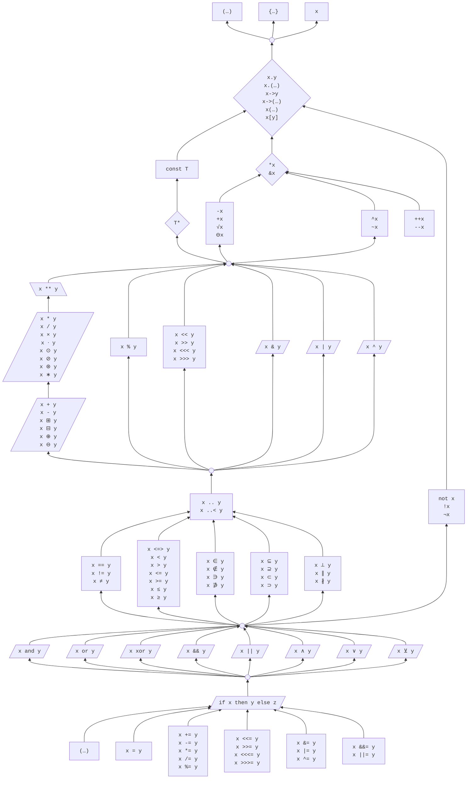
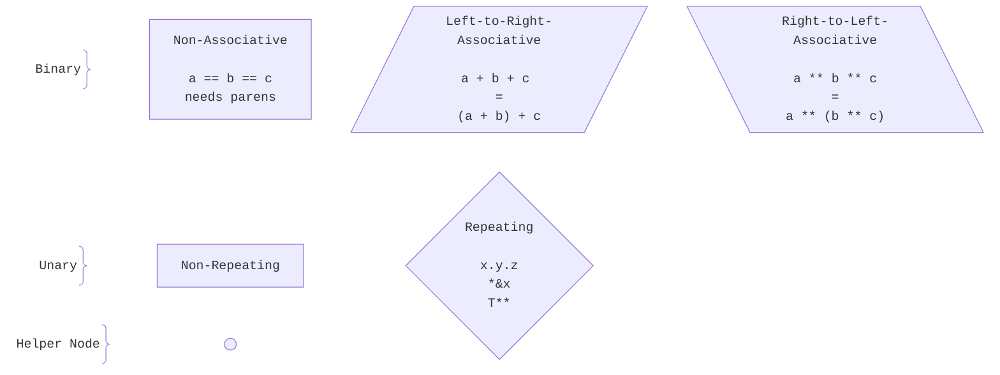

# Unfinished Ideas

Admittedly, many ideas for Cilia are not yet _fully_ developed, but these really do need some more work.


## `T^` to Objects of Other Languages

We can redefine `T^` for interoperability with other languages, e.g. garbage collected languages like C# and Java.

`T^` is defined via type traits `SharedPtrType`:
- For all C++/Cilia classes `T^` is `SharedPtr<T>`:  
  ```
  extension<type T> T {
      using SharedPtrType = SharedPtr<T>
  }
  ```
- Objective-C/Swift classes use their reference counting mechanism:
  ```
  class ObjectiveCObject {
      using SharedPtrType = ObjectiveCRefCountPtr
  }
  ```
- C#/.NET classes use garbage collected memory for instance/object allocation, add instance/object-pointers to the global list of C#/.NET instance pointers (with GCHandle and/or gcroot).  
  ```
  class DotNetObject {
      using SharedPtrType = DotNetGCPtr
  }
  ```
    - Access/dereferencing creates a temporary `DotNetGCPinnedPtr`, that pins the object (so the garbage collector cannot move it during access).
- Java classes use garbage collected memory, add pointers to the global list of Java instance pointers.  
  ```
  class JavaObject {
      using SharedPtrType = JavaGCPtr
  }
  ```
    - Probably very similar to C#/.NET.

`T+` is defined via type traits `UniquePtrType`:
- For C++/Cilia classes `T+` is `UniquePtr<T>`:
  ```
  extension<type T> T {
      using UniquePtrType = UniquePtr<T>
  }
  ```
- For Objective-C/Swift, C#/.NET, and Java the `UniquePtrType` will be very similar to the `SharedPtrType`, maybe even identical.


## Exotic Operators (e.g. Unicode)

### Logical / Bool Operators

It is also possible to use the mathematical symbols **`∧`**, **`∨`**, **`⊼`**, **`⊽`**, **`¬`** for `and`, `or`, `nand`, `nor`, `not`.
```
operator (Bool a) ∧ (Bool b) -> Bool { return a and b }
operator (Bool a) ∨ (Bool b) -> Bool { return a or b }
operator (Bool a) ⊼ (Bool b) -> Bool { return a nand b }
operator (Bool a) ⊽ (Bool b) -> Bool { return a nor b }
operator (Bool a) ⊻ (Bool b) -> Bool { return a xor b }
operator ¬(Bool a) -> Bool { return not a }
```


### Vector / Matrix Operators

```
operator (Vec3 a) × (Vec3 b) -> Vec3       { ... }   // cross product (beware of confusion with the letter 'x')
operator (Vec a) ⋅ (Vec b) -> Float        { ... }   // dot / scalar / inner product

operator (Matrix a) ⊙ (Matrix b) -> Matrix { ... }   // Hadamard (element-wise) product
operator (Matrix a) ⊘ (Matrix b) -> Matrix { ... }   // Hadamard (element-wise) division
operator (Matrix a) ⊞ (Matrix b) -> Matrix { ... }   // element-wise addition ("boxplus")
operator (Matrix a) ⊟ (Matrix b) -> Matrix { ... }   // element-wise subtraction ("boxminus")

operator (Vec a) ⊕ (Vec b) -> Vec          { ... }   // direct sum: {1 2} ⊕ {3 4} -> {1 2 3 4}
operator ⊖(Vec a) -> Vec                   { ... }   // negation (unary)
operator (Vec a) ⊖ (Vec b) -> Vec          { ... }   // subtraction (binary)
operator (Signal a) ⊛ (Signal b) -> Signal { ... }   // convolution
operator (Signal a) ∗ (Signal b) -> Signal { ... }   // convolution (alternative)

func ∠(Vec a, b) -> Float        { ... }  // angle between two vectors
func ∠(Point3D a, b, c) -> Float { ... }  // angle between three points (vectors ab and bc)
```

Unclear, if these should have an epsilon (ε) value here. And then they would be function calls, not infix operators:
```
operator (Vec a) ⟂ (Vec b) -> Bool { ... }   // perpendicular / orthogonal
operator (Vec a) ∥ (Vec b) -> Bool { ... }   // parallel to
operator (Vec a) ∦ (Vec b) -> Bool { ... }   // not parallel to
```

### Set Operators

The set membership/subset symbols parse as relational operators, i.e. they inherit the (infix) fixity and precedence group of the comparison operators:
```
// Set membership
operator (T x) ∈ (Set<T> s) -> Bool { return s.contains(x) }
operator (T x) ∉ (Set<T> s) -> Bool { return not s.contains(x) }
operator (Set<T> s) ∋ (T x) -> Bool { return s.contains(x) }
operator (Set<T> s) ∌ (T x) -> Bool { return not s.contains(x) }

// Subset / superset
operator (Set<T> a) ⊆ (Set<T> b) -> Bool { return a.isSubsetOf(b) }
operator (Set<T> a) ⊇ (Set<T> b) -> Bool { return a.isSupersetOf(b) }
operator (Set<T> a) ⊂ (Set<T> b) -> Bool { return a.isProperSubsetOf(b) }
operator (Set<T> a) ⊃ (Set<T> b) -> Bool { return a.isProperSupersetOf(b) }
```

### Operator Precedence

List of **all currently known operators**:

- Postfix
    - `a()` `a[]` `a.b` `a++` `a--`
- Prefix
    - `+a` `-a` `!` `not` `~` `++a` `--a` `√` `⊖` `¬`
- Infix
    - `**`
    - `*` `/` `%`
    - `×` `⋅`
    - `⊙` `⊘`
    - `⊛` `∗`
    - `+` `-` `⊞` `⊟` `⊕` `⊖`
    - Shift / Rotation
        - `<<` `>>` `<<<` `>>>`
    - Bitwise
        - `&` `^` `|`
    - Logical
        - `and` `xor` `or`
        - `&&` `||` 
        - `∧` `⊻` `∨` 
    - `..` `..<`
    - Comparison
        - `<=>`
        - `<` `>` `<=` `>=` `≤` `≥`
    - `∈` `∉` `∋` `∌`
    - `⊆` `⊇` `⊂` `⊃`
    - `⟂` `∥` `∦`
    - Equality
        - `==` `!=` `≠`
    - Assignment
        - `=`
        - `+=` `-=` `*=` `/=` `%=`
        - `<<=` `>>=` `<<<=` `>>>=`
        - `&=` `|=` `^=`
        - `&&=` `||=`

> **Note**  
> The global precedence ordering should be replaced by partial precedence ordering,
> as nobody can remember all these precedence levels.
> 
> See [Carbon Expression Precedence](https://github.com/carbon-language/carbon-lang/blob/trunk/docs/design/expressions/README.md#precedence):
>> Expressions are interpreted based on a partial precedence ordering. Expression components which lack a relative ordering must be disambiguated by the developer, for example by adding parentheses; otherwise, the expression will be invalid due to ambiguity. Precedence orderings will only be added when it's reasonable to expect most developers to understand the precedence without parentheses.
> 
> Also see [Circle simpler_precedence](https://github.com/carbon-language/carbon-lang/blob/trunk/docs/design/expressions/README.md#precedence)


{:.extra-wide-pre}


The graph above covers the **partial** ordering of all contemplated Unicode/Cilia operators. Relations that most developers can be expected to know are drawn as edges, e.g.
- `*` tighter than `+`,
- `**` tighter than `*`,
- arithmetic tighter than ranges,
- ranges tighter than the comparisons,
- and all of these tighter than the logical operators and assignment.

This avoids the well-known C/C++ pitfall where `x & mask == 0` parses as `x & (mask == 0)`; here it parses as the intended `(x & mask) == 0`.

Pairs that nobody reliably ranks are left **unordered** on purpose and therefore require explicit parentheses, e.g.:
- the bitwise operators `&` `^` `|` relative to each other and to `<<`/`>>`, `%`, `**`, and `+`/`-`,
- `..`/`..<` relative to `<=>`,
- `<`/`<=`/…, `==`/`!=`, and `<=>` relative to each other,
- `and`, `&&`, `∧`, `xor`, `⊻`, `or`, `||`, and `∨` relative to each other.


The **node shapes** encode each group's

- associativity (for binary operators)
    - non-associative,
    - left-to-right-associative,
    - right-to-left-associative,
- or the analogous repeatability (for unary operators),
    - non-repeating,
    - repeating,

i.e. what it means to chain the **same** precedence group without parentheses.  
Circles are helper nodes only (not a precedence group).





### Custom Operators with Declared Precedence

For some symbols fixity and precedence have to be given at declaration. 

The two main difficulties (see also the [Operators](/advanced/operators/) chapter) are:
- operator precedence,
- unary (prefix, postfix) vs. binary (infix) operators.

Modelled after Swift/Haskell, preferably with _named_ precedence groups instead of magic numbers:
```
operator (Fn f) ∘ (Fn g)         -> Fn     right precedence Composition     { ... }
operator (Matrix a) ⊗ (Matrix b) -> Matrix left  precedence Tensor          { ... }   // tensor / Kronecker product
operator (Set a) ∪ (Set b)       -> Set    left  precedence Union           { ... }   // union
operator (Set a) ∩ (Set b)       -> Set    left  precedence Intersection    { ... }   // intersection (binds tighter than ∪)
operator (Set a) ∖ (Set b)       -> Set    left  precedence Union           { ... }   // set difference: a without b
operator √(Float a)              -> Float                                   { ... }   // unary (prefix by position)
```
- Fixity is determined by the position of the operator symbol: before the operand (prefix, e.g. `√(Float a)`), between the operands (infix, e.g. `(Set a) ∪ (Set b)`), or after the operand (postfix). So unary and binary forms are distinct declarations (just like `-` in C++).
    - Only infix operators need an explicit precedence group; prefix/postfix operators have a fixed (high) precedence, which is why `√` above declares none.
- Allowed operator characters should be a curated whitelist (e.g. mathematical symbols U+2200–U+22FF plus some, e.g. `×` U+00D7, `⟂` U+27C2, `⟨ ⟩` U+27E8/9, `‖` U+2016), so the lexer can cleanly separate identifiers and operators.
- The whitelist should exclude (or the compiler should warn about) characters that are easily confused with ASCII operators or with each other, e.g. `∗` U+2217 vs. `*`, `∥` U+2225 vs. `||`, `⋅` U+22C5 vs. `.`, `∼` U+223C vs. `~` (see [Unicode TR39](https://www.unicode.org/reports/tr39/) confusables).


### Bracket / "Sandwich" Operator

`‖x‖`, `⟨a, b⟩` etc. are not infix operators but paired delimiters ("enclosing operator", "delimited form", "bracketed expression", informally "sandwich operator").
```
operator ‖Vec v‖ -> Float  { return v.length() }  // norm
operator ⟨T a, b⟩ -> Float { ... }                // inner product
```
- `|x|` for `abs(x)` is problematic, as `|` is also the bitwise `or` operator, but it _is_ parseable:
    - a position-aware (Pratt) parser tells the two apart by position, just like prefix vs. infix `-` (see above). In _operand_ position (expression start, after an infix operator, after `(`, `,`, `=`, …) a `|` can only _open_ an abs; in _operator_ position it _closes_ the innermost open abs, otherwise it is infix bitwise `or`. This stays unambiguous because Cilia has no implicit multiplication — so `a | b | c` can only be bitwise `or`, and even `|a + |b||` nests cleanly as `abs(a + abs(b))`.
    - The only real cost: a bitwise `or` _directly_ inside an abs must be parenthesized as `|(a | b)|`, because a bare `|a | b|` closes after `a`. That is a clear compile error, not a silent misparse.
- `||x||` for `norm(x)` als needs a position-aware parser to distinguish from logical-or. Or use `‖x‖` (U+2016).
- Symmetric delimiters that use the _same_ character for open and close (`‖…‖`, `|…|`) can in fact be parsed and nested via the position rule above (`‖a + ‖b‖‖` = `norm(a + norm(b))`), but the close-first rule is not obvious to human readers and editor bracket-matching is hard. Asymmetric pairs (e.g. `⟨…⟩`) avoid all of this.

More bracket variants (asymmetric pairs only; some may be used in reversed order, e.g. `≫...≪`; see also [Unicode Math Brackets](http://xahlee.info/comp/unicode_math_brackets.html)):

| Pair    | Category       | Name / note                                                      |
| ------- | -------------- | ---------------------------------------------------------------- |
| `⟨...⟩` | angle          | angle brackets (inner product, see above)                        |
| `⟪...⟫` | angle          | double angle brackets                                            |
| `⦑...⦒` | angle          | angle bracket with dot                                           |
| `⦅...⦆` | round          | double parenthesis                                               |
| `⟮...⟯` | round          | flattened parenthesis                                            |
| `⦃...⦄` | curly          | white curly bracket                                              |
| `...` | square         | white / semantic ("Scott") square brackets                       |
| `⦋...⦌` | square         | square bracket with underbar                                     |
| `⦍...⦎` | square         | square bracket with ticks                                        |
| `⦏...⦐` | square         | square bracket with ticks (mirrored)                             |
| `⁅...⁆` | square         | square bracket with quill                                        |
| `⌊...⌋` | floor/ceiling  | floor (round down)                                               |
| `⌈...⌉` | floor/ceiling  | ceiling (round up)                                               |
| `⦗...⦘` | tortoise-shell | black tortoise-shell bracket                                     |
| `⟬...⟭` | tortoise-shell | white tortoise-shell bracket                                     |
| `⦇...⦈` | Z notation     | image bracket                                                    |
| `⦉...⦊` | Z notation     | binding bracket                                                  |
| `⦓...⦔` | arc            | arc less/greater-than bracket                                    |
| `⦕...⦖` | arc            | double-line arc bracket                                          |
| `⟅...⟆` | bag            | S-shaped bag delimiter                                           |
| `⌜...⌝` | corners        | top corners (quine corners)                                      |
| `⌞...⌟` | corners        | bottom corners                                                   |
| `⸢...⸣` | corners        | top half brackets                                                |
| `⸤...⸥` | corners        | bottom half brackets                                             |
| `≪...≫` | operator       | much-less/greater-than (relational operator, not a true bracket) |
| `⋘...⋙` | operator       | very-much-less/greater-than (operator)                           |
| `‹...›` | quotation      | single guillemets (quotation, not math)                          |
| `«...»` | quotation      | double guillemets (quotation, not math)                          |
| `❨...❩` | ornamental     | parenthesis ornament (decorative)                                |
| `❪...❫` | ornamental     | flattened parenthesis ornament                                   |
| `❬...❭` | ornamental     | angle bracket ornament                                           |
| `❮...❯` | ornamental     | heavy angle quotation ornament                                   |
| `❰...❱` | ornamental     | heavy angle bracket ornament                                     |
| `❲...❳` | ornamental     | tortoise-shell bracket ornament                                  |
| `❴...❵` | ornamental     | curly bracket ornament                                           |


### Later / Never

Many of the symbols seem more suitable for a computer algebra system (CAS) than for a general purpose programming language, so they stay unassigned for now.

Reserved for future use, as it could get complicated and confusing.
Remaining candidate symbols, not yet assigned to one of the cases above (with their usual mathematical meaning):

- `∑`, `∏`, `∫`, `∮` are _not_ operators: they need an index/binder (e.g. `∑_{i=1}^{n}`), so for now they stay plain functions `sum(...)`, `product(...)`, `integrate(...)`.

- Definition / assignment
    - `≔` "colon equals" (`:=`) – defined as / assignment.
    - `≕` "equals colon" (`=:`) – same, but reversed direction.
    - `≜` "delta equal to" – equal by definition.
    - `≝` "equal to by definition".
- Logic / proof notation
    - `∴` therefore.
    - `∵` because.
    - `∅` empty set.
    - `∞` infinity.
- Calculus
    - `∇` nabla / del – gradient, divergence, curl.
    - `∂` partial derivative.‚
- Geometry
    - `∟` right angle.
- Ratios / proportions
    - `∶` ratio (`a ∶ b`).
    - `∷` proportion (`a∶b ∷ c∶d`); beware: `::` is the scope operator in C++ & Cilia.
    - `∝` "proportional to" – `isProportional(a, b)`.
- Approximate comparison / similarity
    - `≈` "almost equal to" – `isClose(a, b)`.
    - `≉` "not almost equal to" – `not isClose(a, b)`.
    - `∼` "tilde operator" / "similar to" – `isSimilar(a, b)`.


## OpenMP-like Parallel Programming

- Serial code
  ```
  Float[] arr = ...
  for i in 0..<arr.size() {
      arr[i] = 2 * arr[i]
  }
  ```
- Parallel code
  ```
  for i in 0..<arr.size() parallel { ... }
  ```
  ```
  for i in 0..<arr.size()
  parallel batch(1024) { ... }
  ```
  ```
  for i in 0..<arr.size()
  parallel if arr.size() > 65535 { ... }
  ```
  ```
  for i in 0..<arr.size() parallel reduce(sum: +) { ... }
  ```
  ```
  for i in 0..<arr.size()
  parallel
  if arr.size() > 65535
  reduce(sum: +)
  schedule(dynamic, 65536) { ... }
  ```

> TODO  
> Syntactically this is not a good solution.
> - We avoid brackets in `if` and `while`, but then use it for `reduce` and `schedule`...
> - Syntax should be better, clearer, or more powerful than plain OpenMP, otherwise better use just that.
