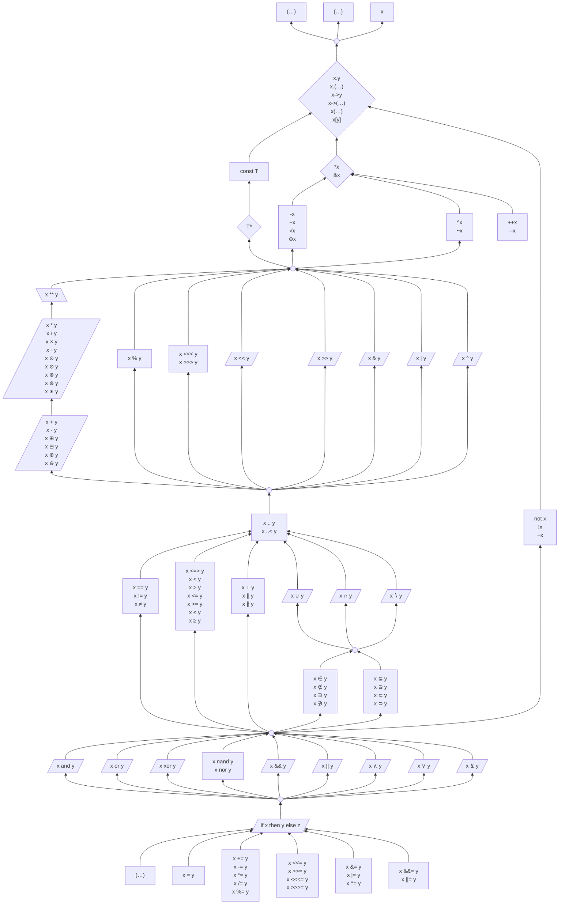
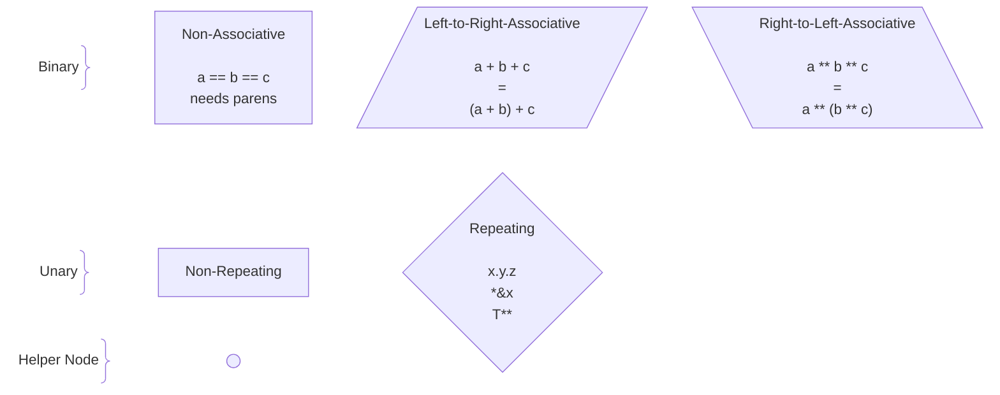

# Unfinished Ideas

Admittedly, many ideas for Cilia are not yet _fully_ developed, but these really do need some more work.


## `T^` to Objects of Other Languages

We can redefine `T^` for interoperability with other languages, e.g. garbage collected languages like C# and Java.

`T^` is defined via type traits `SharedPtrType`:
- For all C++/Cilia classes `T^` is `SharedPtr<T>`:  
  ```
  extension<type T> T {
      using SharedPtrType = SharedPtr<T>
  }
  ```
- Objective-C/Swift classes use their reference counting mechanism:
  ```
  class ObjectiveCObject {
      using SharedPtrType = ObjectiveCRefCountPtr
  }
  ```
- C#/.NET classes use garbage collected memory for instance/object allocation, add instance/object-pointers to the global list of C#/.NET instance pointers (with GCHandle and/or gcroot).  
  ```
  class DotNetObject {
      using SharedPtrType = DotNetGCPtr
  }
  ```
    - Access/dereferencing creates a temporary `DotNetGCPinnedPtr`, that pins the object (so the garbage collector cannot move it during access).
- Java classes use garbage collected memory, add pointers to the global list of Java instance pointers.  
  ```
  class JavaObject {
      using SharedPtrType = JavaGCPtr
  }
  ```
    - Probably very similar to C#/.NET.

`T+` is defined via type traits `UniquePtrType`:
- For C++/Cilia classes `T+` is `UniquePtr<T>`:
  ```
  extension<type T> T {
      using UniquePtrType = UniquePtr<T>
  }
  ```
- For Objective-C/Swift, C#/.NET, and Java the `UniquePtrType` will be very similar to the `SharedPtrType`, maybe even identical.


## Exotic Operators (e.g. Unicode)

The examples below show **implementations** only. Each symbol is also registered via `infix operator`, `prefix operator`, or `postfix operator` in the standard library (see [Custom Operators with Declared Precedence](#custom-operators-with-declared-precedence)); built-ins use the precedence groups from the [precedence diagram](#operator-precedence) below.

### Logical / Bool Operators

It is also possible to use the mathematical symbols **`∧`**, **`∨`**, **`⊼`**, **`⊽`**, **`¬`** for `and`, `or`, `nand`, `nor`, `not`.
```
operator (Bool a) ∧ (Bool b) -> Bool { return a and b }
operator (Bool a) ∨ (Bool b) -> Bool { return a or b }
operator (Bool a) ⊼ (Bool b) -> Bool { return a nand b }
operator (Bool a) ⊽ (Bool b) -> Bool { return a nor b }
operator (Bool a) ⊻ (Bool b) -> Bool { return a xor b }
operator ¬(Bool a) -> Bool { return not a }
```


### Vector / Matrix Operators

```
operator (Vec3 a) × (Vec3 b) -> Vec3       { ... }   // cross product (beware of confusion with the letter 'x')
operator (Vec a) ⋅ (Vec b) -> Float        { ... }   // dot / scalar / inner product

operator (Matrix a) ⊙ (Matrix b) -> Matrix { ... }   // Hadamard (element-wise) product
operator (Matrix a) ⊘ (Matrix b) -> Matrix { ... }   // Hadamard (element-wise) division
operator (Matrix a) ⊞ (Matrix b) -> Matrix { ... }   // element-wise addition ("boxplus")
operator (Matrix a) ⊟ (Matrix b) -> Matrix { ... }   // element-wise subtraction ("boxminus")
operator (Matrix a) ⊗ (Matrix b) -> Matrix { ... }   // tensor / Kronecker product

operator (Vec a) ⊕ (Vec b) -> Vec          { ... }   // direct sum: {1 2} ⊕ {3 4} -> {1 2 3 4}
operator ⊖(Vec a) -> Vec                   { ... }   // negation (unary)
operator (Vec a) ⊖ (Vec b) -> Vec          { ... }   // subtraction (binary)
operator (Signal a) ⊛ (Signal b) -> Signal { ... }   // convolution
operator (Signal a) ∗ (Signal b) -> Signal { ... }   // convolution (alternative)

func ∠(Vec a, b) -> Float        { ... }  // angle between two vectors
func ∠(Point3D a, b, c) -> Float { ... }  // angle between three points (vectors ab and bc)
```

Unclear, if these should have an epsilon (ε) value here. And then they would be function calls, not infix operators:
```
operator (Vec a) ⟂ (Vec b) -> Bool { ... }   // perpendicular / orthogonal
operator (Vec a) ∥ (Vec b) -> Bool { ... }   // parallel to
operator (Vec a) ∦ (Vec b) -> Bool { ... }   // not parallel to
```

### Set Operators

Set operators fall into two precedence groups (see precedence diagram below). They are unrelated to scalar relational operators such as `==`, `!=`, `<`, or `>` — there is no precedence ordering between the two domains, and meaningful expressions do not mix them.

**Membership / subset** — `∈`, `∉`, `∋`, `∌`, `⊆`, `⊇`, `⊂`, `⊃` parse as binary infix operators returning `Bool`.

**Algebraic** — `∪`, `∩`, `∖` parse as binary infix operators returning sets. They bind tighter than membership/subset (so `x ∈ A ∪ B` parses as `x ∈ (A ∪ B)`) but looser than range (`..`, `..<`). Mixed algebraic expressions such as `A ∪ B ∩ C` require parentheses.

```
// Set membership
operator (T x) ∈ (Set<T> s) -> Bool { return s.contains(x) }
operator (T x) ∉ (Set<T> s) -> Bool { return not s.contains(x) }
operator (Set<T> s) ∋ (T x) -> Bool { return s.contains(x) }
operator (Set<T> s) ∌ (T x) -> Bool { return not s.contains(x) }

// Subset / superset
operator (Set<T> a) ⊆ (Set<T> b) -> Bool { return a.isSubsetOf(b) }
operator (Set<T> a) ⊇ (Set<T> b) -> Bool { return a.isSupersetOf(b) }
operator (Set<T> a) ⊂ (Set<T> b) -> Bool { return a.isProperSubsetOf(b) }
operator (Set<T> a) ⊃ (Set<T> b) -> Bool { return a.isProperSupersetOf(b) }
```

```
// Set algebra
operator (Set<T> a) ∪ (Set<T> b) -> Set<T> { return a.union(b) }
operator (Set<T> a) ∩ (Set<T> b) -> Set<T> { return a.intersection(b) }
operator (Set<T> a) ∖ (Set<T> b) -> Set<T> { return a.difference(b) }
```

### Operator Precedence

Group names in the diagram below correspond to `precedencegroup` declarations (see [Custom Operators with Declared Precedence](#custom-operators-with-declared-precedence)).

List of **all currently known operators**:

- Postfix
    - `a()` `a[]` `a.b`
    - `a++` `a--`
- Prefix
    - `+a` `-a
    - `!` `not` `~` `¬`
    - `++a` `--a`
    - `√`
    - `⊖`
- Infix
    - Arithmetic
        - `+` `-` `*` `/` `%`
        - `**`
    - Equality
        - `==` `!=` `≠`
    - Comparison
        - `<=>`
        - `<` `>` `<=` `>=` `≤` `≥`
    - Shift / Rotation
        - `<<` `>>` `<<<` `>>>`
    - Logical
        - `and` `or` `nand` `nor` `xor`
        - `&&` `||` 
        - `∧` `∨` `⊼` `⊽` `⊻`
    - Bitwise
        - `&` `|` `^`
    - Assignment
        - `=`
        - `+=` `-=` `*=` `/=` `%=`
        - `<<=` `>>=` `<<<=` `>>>=`
        - `&=` `|=` `^=`
        - `&&=` `||=`
    - Vector & Matrix
        - `×` `⋅`
        - `⊙` `⊘`
        - `⊞` `⊟`
        - `⊕` `⊖`
        - `⊗`
        - `⊛` `∗`
        - `⟂` `∥` `∦`
    - Range
        - `..` `..<`
    - Set (algebraic)
        - `∪` `∩` `∖`
    - Set (relational)
        - `∈` `∉` `∋` `∌`
        - `⊆` `⊇` `⊂` `⊃`

Operator precedence is a **partial** ordering, not a global one, as nobody can remember all these precedence levels.

See [Carbon Expression Precedence](https://github.com/carbon-language/carbon-lang/blob/trunk/docs/design/expressions/README.md#precedence):
> Expressions are interpreted based on a partial precedence ordering. Expression components which lack a relative ordering must be disambiguated by the developer, for example by adding parentheses; otherwise, the expression will be invalid due to ambiguity. Precedence orderings will only be added when it's reasonable to expect most developers to understand the precedence without parentheses.
 
Also see [Circle simpler_precedence](https://github.com/seanbaxter/circle/blob/master/new-circle/README.md#simpler_precedence)

In the diagram below, nodes higher up bind tighter; arrows point from looser toward tighter binding.


```mermaid
%%{init: {'themeVariables': {'fontFamily': 'monospace'}}}%%
graph BT
    parens["(…)"]
    braces["{…}"]
    unqualifiedName["x"]

    top --> parens & braces & unqualifiedName
    top((" "))

    suffixOps --> top
    suffixOps{"x.y
               x.(…)
               x->y
               x->(…)
               x(…)
               x[y]"}

    qualifiedType --> suffixOps
    qualifiedType["const T"]

    pointerType --> qualifiedType
    pointerType{"T*"}

    pointer --> suffixOps
    pointer{"*x
             &x"}

    prefixMath & complement & incDec --> pointer
    complement["^x
                ~x"]
    prefixMath["-x
                +x
                √x
                ⊖x"]
    incDec["++x
            --x"]

    unary --> pointerType & prefixMath & complement
    unary((" "))


    power --> unary
    power[\"x ** y"\]

    multiplication --> power
    multiplication[/"x * y
                    x / y
                    x × y
                    x ⋅ y
                    x ⊙ y
                    x ⊘ y
                    x ⊗ y
                    x ⊛ y
                    x ∗ y"/]
    addition --> multiplication
    addition[/"x + y
              x - y
              x ⊞ y
              x ⊟ y
              x ⊕ y
              x ⊖ y"/]

    modulo & rotate & shiftLeft & shiftRight & bitwiseAnd & bitwiseOr & bitwiseXor ---> unary
    modulo["x % y"]
    rotate["x <<< y
            x >>> y"]
    shiftLeft[/"x << y"/]
    shiftRight[/"x >> y"/]
    bitwiseAnd[/"x & y"/]
    bitwiseOr[/"x | y"/]
    bitwiseXor[/"x ^ y"/]

    binaryOps --> addition & modulo & rotate & shiftLeft & shiftRight & bitwiseAnd & bitwiseOr & bitwiseXor
    binaryOps((" "))

    %% Ranges bind looser than arithmetic/bitwise, tighter than the relational operators
    range --> binaryOps
    range["x .. y
           x ..< y"]

    equality & comparison & parallel --> range
    equality["x == y
              x != y
              x ≠ y"]
    comparison["x <=> y
                x < y
                x > y
                x <= y
                x >= y
                x ≤ y
                x ≥ y"]
    parallel["x ⟂ y
              x ∥ y
              x ∦ y"]

    setUnion & setIntersection & setDifference --> range
    setUnion[/"x ∪ y"/]
    setIntersection[/"x ∩ y"/]
    setDifference[/"x ∖ y"/]

    setOps --> setUnion & setIntersection & setDifference
    setOps((" "))
    membership & subset --> setOps

    membership["x ∈ y
                x ∉ y
                x ∋ y
                x ∌ y"]
    subset["x ⊆ y
            x ⊇ y
            x ⊂ y
            x ⊃ y"]

    %% Use a longer arrow here to put `not` next to other unary operators
    not ---------> suffixOps
    not["not x
         !x
         ¬x"]


    logicalOperand --> equality & comparison & membership & subset & parallel & not
    logicalOperand((" "))


    %% Currently "as" is not yet fully defined, and it obscures the graph layout somehow...
    %% as ------> unary
    %% as["x as T"]

    and & or & xor & nandNor & andAmp & orAmp & andSym & orSym & xorSym --> logicalOperand
    and[/"x and y"/]
    or[/"x or y"/]
    xor[/"x xor y"/]
    nandNor["x nand y
             x nor y"]
    andAmp[/"x && y"/]
    orAmp[/"x || y"/]
    andSym[/"x ∧ y"/]
    orSym[/"x ∨ y"/]
    xorSym[/"x ⊻ y"/]

    %% logicalExpression ---> as
    logicalExpression --> and & or & xor & nandNor & andAmp & orAmp & andSym & orSym & xorSym
    logicalExpression((" "))

    ifThenElse --> logicalExpression
    ifThenElse[/"if x then y else z"/]


    insideParens & assignPlain & assignArithmetic & assignShift & assignBitwise & assignLogical --> ifThenElse
    insideParens["(…)"]
    assignPlain["x = y"]
    assignArithmetic["x += y
                      x -= y
                      x *= y
                      x /= y
                      x %= y"]
    assignShift["x <<= y
                 x >>= y
                 x <<<= y
                 x >>>= y"]
    assignBitwise["x &= y
                   x |= y
                   x ^= y"]
    assignLogical["x &&= y
                   x ||= y"]
```
{:.extra-wide-pre}


The graph above covers the **partial** ordering of all contemplated Unicode/Cilia operators. Relations that most developers can be expected to know are drawn as edges, e.g.
- `*` tighter than `+`,
- `**` tighter than `*`,
- arithmetic tighter than ranges,
- set algebra (`∪` `∩` `∖`) tighter than ranges and tighter than set relations (`∈` `⊆`, …),
- ranges tighter than the comparisons,
- and all of these tighter than the logical operators and assignment.

This avoids the well-known C/C++ pitfall where `x & mask == 0` parses as `x & (mask == 0)`; here it parses as the intended `(x & mask) == 0`.

Pairs that nobody reliably ranks are left **unordered** on purpose and therefore require explicit parentheses, e.g.:
- the bitwise operators `&` `^` `|` relative to each other and to `<<`/`>>`, `%`, `**`, and `+`/`-`,
- `∪`, `∩`, and `∖` relative to each other and to arithmetic/bitwise operators,
- `..`/`..<` relative to `<=>`,
- `<`, `<=`, `>`, `>=`, `==`, `!=`, and `<=>` relative to each other,
- `and`, `or`, `xor`, `&&`, `||`, `∧`, `⊻`, and `∨` relative to each other.


The **node shapes** encode each group's

- associativity (for binary operators)
    - non-associative,
    - left-to-right-associative,
    - right-to-left-associative,
- or the analogous repeatability (for unary operators),
    - non-repeating,
    - repeating,

i.e. what it means to chain the **same** precedence group without parentheses.  
Circles are helper nodes only (not a precedence group).



```mermaid
%%{init: {'themeVariables': {'fontFamily': 'monospace'}}}%%
graph LR
    binary@{ shape: brace-r, label: "Binary" }

    nonAssociative["Non-Associative

a == b == c
needs parens"]

    leftToRightAssociative[/"Left-to-Right-Associative

a + b + c 
=
(a + b) + c"/]

    rightToLeftAssociative[\"Right-to-Left-Associative

a ** b ** c
=
a ** (b ** c)"\]


    unary@{ shape: brace-r, label: "Unary" }

    nonRepeating["Non-Repeating"]

    repeating{"Repeating

 x.y.z
 *&x
 T**"}


    helper@{ shape: brace-r, label: "Helper Node" }

    circle((" "))


    binary ~~~ nonAssociative ~~~ leftToRightAssociative ~~~ rightToLeftAssociative
    unary ~~~ nonRepeating ~~~ repeating
    helper ~~~ circle
```


### Custom Operators with Declared Precedence

For custom symbols, fixity and precedence must be declared explicitly — modelled after [Swift SE-0077](https://github.com/swiftlang/swift-evolution/blob/main/proposals/0077-operator-precedence.md). Operator **implementations** use the existing `operator` syntax from the [Operators](/advanced/operators/) chapter.

The two main difficulties are:
- operator precedence (partial ordering via named _precedence groups_, not magic numbers),
- unary (prefix, postfix) vs. binary (infix) operators.

Declaration is in **three separate steps**:

#### 1. Precedence groups

Named groups replace numeric precedence levels. Groups form a **partial** ordering: neighbouring operators without a defined relation require parentheses (compile error otherwise).

```
precedencegroup Kleisli {
    associativity: right
    lowerThan: LogicalConjunctionPrecedence
}
```

- `associativity`: `left`, `right`, or `none`
- `higherThan` / `lowerThan`: position relative to other groups (see the [precedence diagram](#operator-precedence) above for group names)
- Built-in groups include `MultiplicationPrecedence`, `AdditionPrecedence`, `ComparisonPrecedence`, `LogicalConjunctionPrecedence`, `Power`, `RangeFormationPrecedence`, and others

Built-in example — `**` (power):

```
precedencegroup Power {
    associativity: right
    higherThan: MultiplicationPrecedence
}

infix operator ** : Power
```

#### 2. Operator registration

Fixity and (for infix) precedence group are declared explicitly:

```
infix  operator >=> : Kleisli
infix  operator ∘   : Composition
infix  operator ⊗   : Tensor
infix  operator ∪   : Union
infix  operator ∩   : Intersection
infix  operator ∖   : Union
prefix operator √
postfix operator ?   // example; postfix must not start with ! or ?
```

- Infix operators without a group belong to `DefaultPrecedence` (Swift behaviour).
- Prefix and postfix operators have fixed (high) precedence and need no group.
- Prefix and infix forms of the same symbol (e.g. `-`) are distinct registrations, as in C++ and Swift.
- Word operators (`and`, `or`, `not`, …) are standard-library built-ins; custom operators use symbol tokens.

#### 3. Implementation

Overload the registered symbol using the existing `operator` syntax — **without** inline precedence or fixity:

```
operator (Fn<A,B> f) >=> (Fn<B,C> g) -> Fn<A,C> {
    return fn(a) { return g(f(a)) }
}

operator (Set<T> a) ∪ (Set<T> b) -> Set<T> { return a.union(b) }

prefix operator √(Float a) -> Float { ... }
```

Compound-assignment variants remain member operators inside classes (`operator +=(…)`, etc.).

Full example (groups, registration, and implementations):

```
// --- Precedence groups (declare once, e.g. in a module header) ---
precedencegroup Composition {
    associativity: right
    higherThan: DefaultPrecedence
}
precedencegroup Intersection {
    associativity: left
    higherThan: Union
}
precedencegroup Union {
    associativity: left
    higherThan: RangeFormationPrecedence
}
precedencegroup Kleisli {
    associativity: right
    lowerThan: LogicalConjunctionPrecedence
}

// --- Operator registration (fixity + precedence) ---
infix  operator ∘   : Composition
infix  operator ⊗   : Tensor
infix  operator ∪   : Union
infix  operator ∩   : Intersection
infix  operator ∖   : Union
infix  operator >=> : Kleisli
prefix operator √

// --- Implementations (anywhere overloads are allowed) ---
operator (Fn f) ∘ (Fn g)             -> Fn     { ... }
operator (Matrix a) ⊗ (Matrix b)     -> Matrix { ... }   // tensor / Kronecker product
operator (Set a) ∪ (Set b)           -> Set    { ... }   // union
operator (Set a) ∩ (Set b)           -> Set    { ... }   // intersection (binds tighter than ∪)
operator (Set a) ∖ (Set b)           -> Set    { ... }   // set difference: a without b
operator (Fn<A,B> f) >=> (Fn<B,C> g) -> Fn<A,C> { ... } // Kleisli composition
prefix operator √(Float a)           -> Float  { ... }
```

#### Allowed operator characters

Operator names follow Swift's _operator-head + operator-characters_ grammar:

- **operator-head:** ASCII `/ = - + * % < > & | ! ^ ? ~` plus Unicode math, symbol, and arrow blocks
- **operator-characters:** further characters from the same sets, plus combining marks
- Multi-character operators such as `>=>`, `>>=`, `<<`, `**`, `<=>`, `∪`, `⊗` are all valid; the lexer uses longest match (`>=>` before `>` + `=`).
    - Dot-prefixed operators (e.g. `..`, `..<`) are built-ins; a `.` may appear elsewhere in an operator only when the operator starts with `.` (Swift rule).
    - Reserved tokens cannot be used as custom operators: `( ) { } [ ] , ; : @ # ->`, a lone `?`, prefix `<` / `&` / `?`, postfix `>` / `!` / `?`. Postfix operators must not begin with `!` or `?`.
- **Confusables:** the compiler should _warn_ (not reject) about characters easily confused with ASCII operators, e.g. `∗` U+2217 vs. `*`, `∥` U+2225 vs. `||`, `⋅` U+22C5 vs. `.`, `∼` U+223C vs. `~` (see [Unicode TR39](https://www.unicode.org/reports/tr39/) confusables).

- **Partial ordering:** if two neighbouring infix operators have precedence groups with no defined relation, the expression is a compile error unless parenthesized (e.g. `1 + 2 & 3` is illegal, as in Swift).
- **Bracket / "sandwich" operators** (`‖x‖`, `⟨a, b⟩`, …) are a separate category — not registered via `infix operator` (see below).


### Bracket / "Sandwich" Operator

`‖x‖`, `⟨a, b⟩` etc. are not infix operators but paired delimiters ("enclosing operator", "delimited form", "bracketed expression", informally "sandwich operator").
```
operator ‖Vec v‖ -> Float  { return v.length() }  // norm
operator ⟨T a, b⟩ -> Float { ... }                // inner product
```
- `|x|` for `abs(x)` is problematic, as `|` is also the bitwise `or` operator, but it _is_ parseable:
    - a position-aware (Pratt) parser tells the two apart by position, just like the distinct prefix and infix registrations of `-`. In _operand_ position (expression start, after an infix operator, after `(`, `,`, `=`, …) a `|` can only _open_ an abs; in _operator_ position it _closes_ the innermost open abs, otherwise it is infix bitwise `or`. This stays unambiguous because Cilia has no implicit multiplication — so `a | b | c` can only be bitwise `or`, and even `|a + |b||` nests cleanly as `abs(a + abs(b))`.
    - The only real cost: a bitwise `or` _directly_ inside an abs must be parenthesized as `|(a | b)|`, because a bare `|a | b|` closes after `a`. That is a clear compile error, not a silent misparse.
- `||x||` for `norm(x)` also needs a position-aware parser to distinguish from logical-or. Or use `‖x‖` (U+2016).
- Symmetric delimiters that use the _same_ character for open and close (`‖…‖`, `|…|`) can in fact be parsed and nested via the position rule above (`‖a + ‖b‖‖` = `norm(a + norm(b))`), but the close-first rule is not obvious to human readers and editor bracket-matching is hard. Asymmetric pairs (e.g. `⟨…⟩`) avoid all of this.

More bracket variants (asymmetric pairs only; some may be used in reversed order, e.g. `≫...≪`; see also [Unicode Math Brackets](http://xahlee.info/comp/unicode_math_brackets.html)):

| Pair    | Category       | Name / note                                                      |
| ------- | -------------- | ---------------------------------------------------------------- |
| `⟨...⟩` | angle          | angle brackets (inner product)                                    |
| `⟪...⟫` | angle          | double angle brackets                                            |
| `⦑...⦒` | angle          | angle bracket with dot                                           |
| `⦅...⦆` | round          | double parenthesis                                               |
| `⟮...⟯` | round          | flattened parenthesis                                            |
| `⦃...⦄` | curly          | white curly bracket                                              |
| `⟦...⟧` | square         | white / semantic ("Scott") square brackets                       |
| `⦋...⦌` | square         | square bracket with underbar                                     |
| `⦍...⦎` | square         | square bracket with ticks                                        |
| `⦏...⦐` | square         | square bracket with ticks (mirrored)                             |
| `⁅...⁆` | square         | square bracket with quill                                        |
| `⌊...⌋` | floor/ceiling  | floor (round down)                                               |
| `⌈...⌉` | floor/ceiling  | ceiling (round up)                                               |
| `⦗...⦘` | tortoise-shell | black tortoise-shell bracket                                     |
| `⟬...⟭` | tortoise-shell | white tortoise-shell bracket                                     |
| `⦇...⦈` | Z notation     | image bracket                                                    |
| `⦉...⦊` | Z notation     | binding bracket                                                  |
| `⦓...⦔` | arc            | arc less/greater-than bracket                                   |
| `⦕...⦖` | arc            | double-line arc bracket                                         |
| `⟅...⟆` | bag            | S-shaped bag delimiter                                           |
| `⌜...⌝` | corners        | top corners (quine corners)                                      |
| `⌞...⌟` | corners        | bottom corners                                                   |
| `⸢...⸣` | corners        | top half brackets                                                |
| `⸤...⸥` | corners        | bottom half brackets                                             |
| `≪...≫` | operator       | much-less/greater-than (relational operator, not a true bracket) |
| `⋘...⋙` | operator       | very-much-less/greater-than (operator)                           |
| `‹...›` | quotation      | single guillemets (quotation, not math)                          |
| `«...»` | quotation      | double guillemets (quotation, not math)                          |
| `❨...❩` | ornamental     | parenthesis ornament (decorative)                                |
| `❪...❫` | ornamental     | flattened parenthesis ornament                                   |
| `❬...❭` | ornamental     | angle bracket ornament                                           |
| `❮...❯` | ornamental     | heavy angle quotation ornament                                   |
| `❰...❱` | ornamental     | heavy angle bracket ornament                                     |
| `❲...❳` | ornamental     | tortoise-shell bracket ornament                                  |
| `❴...❵` | ornamental     | curly bracket ornament                                           |


### Later / Never

Many of the symbols seem more suitable for a computer algebra system (CAS) than for a general purpose programming language, so they stay unassigned for now.

Reserved for future use, as it could get complicated and confusing.
Remaining candidate symbols, not yet assigned to one of the cases above (with their usual mathematical meaning):

- `∑`, `∏`, `∫`, `∮` are _not_ operators: they need an index/binder (e.g. `∑_{i=1}^{n}`), so for now they stay plain functions `sum(...)`, `product(...)`, `integrate(...)`.

- Definition / assignment
    - `≔` "colon equals" (`:=`) – defined as / assignment.
    - `≕` "equals colon" (`=:`) – same, but reversed direction.
    - `≜` "delta equal to" – equal by definition.
    - `≝` "equal to by definition".
- Logic / proof notation
    - `∴` therefore.
    - `∵` because.
    - `∅` empty set.
    - `∞` infinity.
- Calculus
    - `∇` nabla / del – gradient, divergence, curl.
    - `∂` partial derivative.‚
- Geometry
    - `∟` right angle.
- Ratios / proportions
    - `∶` ratio (`a ∶ b`).
    - `∷` proportion (`a∶b ∷ c∶d`); beware: `::` is the scope operator in C++ & Cilia.
    - `∝` "proportional to" – `isProportional(a, b)`.
- Approximate comparison / similarity
    - `≈` "almost equal to" – `isClose(a, b)`.
    - `≉` "not almost equal to" – `not isClose(a, b)`.
    - `∼` "tilde operator" / "similar to" – `isSimilar(a, b)`.


## OpenMP-like Parallel Programming

- Serial code
  ```
  Float[] arr = ...
  for i in 0..<arr.size() {
      arr[i] = 2 * arr[i]
  }
  ```
- Parallel code
  ```
  for i in 0..<arr.size() parallel { ... }
  ```
  ```
  for i in 0..<arr.size()
  parallel batch(1024) { ... }
  ```
  ```
  for i in 0..<arr.size()
  parallel if arr.size() > 65535 { ... }
  ```
  ```
  for i in 0..<arr.size() parallel reduce(sum: +) { ... }
  ```
  ```
  for i in 0..<arr.size()
  parallel
  if arr.size() > 65535
  reduce(sum: +)
  schedule(dynamic, 65536) { ... }
  ```

> TODO  
> Syntactically this is not a good solution.
> - We avoid brackets in `if` and `while`, but then use it for `reduce` and `schedule`...
> - Syntax should be better, clearer, or more powerful than plain OpenMP, otherwise better use just that.
